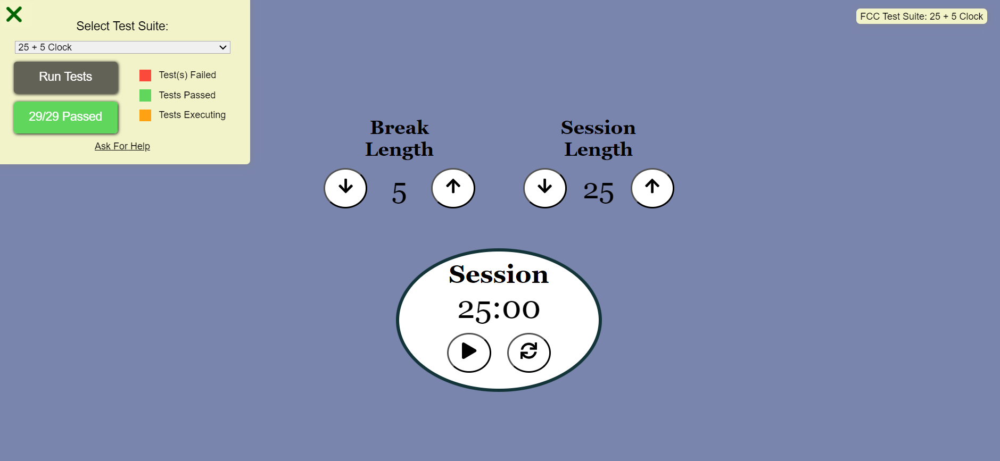

# React Pomodoro Timer ⏲️

## Description 📜

The React Pomodoro Timer is a web application that implements the Pomodoro Technique to help users manage their time more effectively. This technique divides work into intervals, typically 25 minutes of focused work followed by a 5-minute break. The app helps users stay productive by providing visual cues and managing session timing.
    
The project replicates the functionality of the 25 + 5 Clock as specified by freeCodeCamp, and it is built using React. It includes all required user stories and features to meet the project specifications.

## Technologies Used 💡
- **Frontend**: React
- **State Management**: Redux
- **Styling**: CSS
- **Testing**: FreeCodeCamp's test suite (CDN)

## Demo 📸

## Installation 💻

Folow these steps to set up the project on your local machine Ensure you have the following software installed on your machine

# git clone 
https://github.com/fatiabdulahi/Clock/pull/1

## Usage 🎯

you can access to my project through git clone -git clone the HTTP or My SSH code link from the repository you wat to clone

# git clone

## How to Run the Project

Clone the repository to your local machine.
Install the dependencies by running npm install or yarn install.
Start the development server by running npm start or yarn start.
Open your web browser and navigate to http://localhost:3000 to view the Markdown previewer.

## Features ⭐
Play various drum sounds by clicking on the drum pads or pressing the corresponding keyboard keys.
The current drum sound being played is displayed in the #display element.
Responsive design that adapts to different screen sizes.

## Author 👩‍💻 FATIMA ABDULLAHI

Provide your name and a link to your Social Media profiles. You can also include your email address.

- LinkedIn:https://www.linkedin.com/in/fatima-abdullahi-6288662b2
- Email: fatima333abdullahi@gmail.com

## Contributing 🤝

Specify the license under which your project is distributed. Include any relevant copyright or attribution notices.
We welcome contributions from the community! Please follow the guidelines below to contribute to our project.
1: Fork the Repository: Click the "Fork" button at the top right of the repository page to create a copy of the repository on your GitHub account.
2: Clone Your Fork: Clone your forked repository to your local machine using the following command:git clone ttps://github.com/yourusername/yourprojectname.gith
3: Create a Branch: Create a new branch for your work to ensure your changes are isolated from the main branch:git checkout -b feature-or-bugfix-description
4: Make Your Changes: Implement your changes, whether fixing a bug or adding a new feature. Be sure to follow the project's coding standards and guidelines.
5: Commit Your Changes: Commit your changes with a descriptive commit message:git add . git commit -m "Description of the changes"
6: Push to Your Fork: Push your changes to your forked repository:git push origin feature-or-bugfix-description
7: Submit a Pull Request: Go to the original repository and submit a pull request from your forked repository. Provide a clear and concise description of your changes and why they should be merged.

## License 📜
